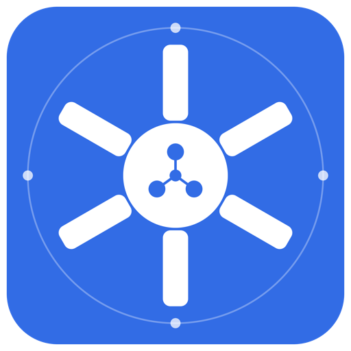

<p align="center">
  
</p>

<h1 align="center">Kentinel</h1>
<p align="center"><b>The AI sentinel for your Kubernetes cluster.</b></p>

A modern Kubernetes console with a built-in AI agent that continuously
reviews your cluster, alerts you when something breaks (Discord / Slack /
Teams), and answers ad-hoc questions like *"why is payments-api failing?
check its logs"* — using **read-only** tools against your live cluster, so it
can diagnose anything but modify nothing. Works fully self-hosted: with the
Ollama provider, no cluster data ever leaves your infrastructure.

## Features

- **Dashboard** — nodes / pods / namespaces / deployments at a glance, pod
  health breakdown, recent warning events
- **AI cluster review** — a separate agent service reviews the cluster every
  few minutes with an LLM and shows a healthy / warning / critical verdict
  with concrete findings and recommendations
- **AI assistant** — chat with an agent that inspects your resources, logs and
  events using **read-only** tools; it can diagnose but never modify anything
- **Two operating modes** — `readonly` (default; observe + Q&A, cannot change
  anything, enforced by RBAC) or `assisted` (the agent proposes fixes as a
  reviewable diff; you approve and the server applies — never autonomous). See
  [docs/security.md](docs/security.md)
- **Review history & trends** — every review is persisted (SQLite on a PVC),
  with a 24h status timeline on the dashboard and a filterable history page —
  "when did this start?" has an answer even after pod restarts
- **Metrics-aware diagnosis** — a bundled minimal Prometheus (or your
  existing one) gives the agent CPU/memory/throttling visibility: it can spot
  CPU-throttled pods, memory creep before the OOMKill, and over-provisioning
- **Resource browser** — pods, deployments, statefulsets, daemonsets, services,
  configmaps, secrets, ingresses, PVCs, jobs, cronjobs, nodes
- **Manifest editing** — view and edit any resource's YAML in a Monaco editor
- **Logs** — tail and follow pod logs (per container, previous instance too)
- **Terminal** — exec into pods right from the browser (xterm.js)
- **Events** — cluster events with namespace/type filtering
- **Five LLM providers** — local models via Ollama (default, free), or
  Anthropic Claude, OpenAI, DeepSeek, Google Gemini — switch from the UI,
  keys stored write-only
- **Discord / Slack / Teams notifications** — get alerted when the cluster
  status changes (healthy → warning → critical, and recoveries);
  transition-based, never spammy, configurable severity threshold
- **Settings page** — view and change all agent parameters from the UI;
  changes apply live and persist encrypted to the agent's own database
- **LLM usage & cost** — the dashboard tracks Kentinel's own token usage
  (review loop vs. assistant) and shows an estimated 30-day cost for cloud
  providers; local Ollama is free
- **Update checks** — the dashboard checks GitHub for new releases and shows
  a ready-to-run `helm upgrade` command when one's available
- **In-app documentation** — this entire docs set is browsable in the UI
  (sidebar → System → Documentation)
- Dark mode, obviously.

## Architecture (short version)

Two services + one SPA. The **server** (Go) exposes the Kubernetes REST/stream
API and serves the frontend; the **agent** (Go) runs separately, holds the LLM
loop, and only has read-only cluster access. See
[docs/architecture.md](docs/architecture.md).

```
React SPA ⇄ server (k8s CRUD, logs, exec, proxy) ⇄ agent (monitor loop + query engine) ⇄ Claude / Ollama
```

## Install — Kubernetes (Helm)

Everything runs local-first out of the box: a bundled Ollama (small model)
and a bundled minimal Prometheus. No API keys required.

```sh
helm install kentinel oci://ghcr.io/emreoztoprak/charts/kentinel \
  -n kentinel --create-namespace

kubectl -n kentinel port-forward svc/kentinel-server 8080:80
# open http://localhost:8080
```

By default this installs in **read-only mode** — Kentinel observes and answers
questions but cannot change any resource (the server's RBAC has no write/exec
verbs). To let the agent propose fixes you approve, and enable the manifest
editor and pod terminal, deploy in **assisted mode**:

```sh
helm install kentinel oci://ghcr.io/emreoztoprak/charts/kentinel \
  -n kentinel --create-namespace \
  --set mode=assisted
```

Assisted mode is still safe by design: the agent never applies anything
itself — it proposes a change, you approve it inline, and the server applies
it. See [docs/security.md](docs/security.md). Switching modes requires a
redeploy.

Common variations (LLM/metrics settings are also switchable later from the
Settings UI):

```sh
# Use a cloud LLM instead of the bundled Ollama
helm install kentinel oci://ghcr.io/emreoztoprak/charts/kentinel \
  -n kentinel --create-namespace \
  --set llm.provider=anthropic \
  --set llm.apiKeys.anthropic=sk-ant-... \
  --set ollama.enabled=false

# Reuse an existing Prometheus
  --set prometheus.enabled=false \
  --set prometheus.externalUrl=http://prometheus.monitoring.svc:9090
```

Prefer raw manifests? `kubectl apply -f deploy/k8s/` deploys the same stack
(see [docs/deployment.md](docs/deployment.md)).

## Install — Docker (local machine)

Runs against any cluster your kubeconfig can reach — nothing to build:

```sh
curl -fsSLO https://raw.githubusercontent.com/emreoztoprak/kentinel/main/deploy/docker/docker-compose.yml
docker compose --profile ollama up -d
docker compose exec ollama ollama pull qwen3:0.6b   # once
# open http://localhost:8080
```

Cloud LLM instead of Ollama:

```sh
export ANTHROPIC_API_KEY=sk-ant-...   # or OPENAI_API_KEY / DEEPSEEK_API_KEY / GEMINI_API_KEY
LLM_PROVIDER=anthropic docker compose up -d
```

Docker mode also defaults to read-only. For approval-gated remediation +
manifest editing, set `KENTINEL_MODE=assisted` (on both services in
`docker-compose.yml`, or `KENTINEL_MODE=assisted docker compose up -d`).

> Note for kind/minikube users: the API server address in your kubeconfig must
> be reachable from inside the containers. See
> [docs/deployment.md](docs/deployment.md#docker-mode-with-kindminikube).

## Try it: break a shop, watch the AI find it

A demo microservice stack ships with the repo — deploy it healthy, then
break it in four realistic ways (crash-loop with meaningful logs, image-tag
typo, CPU throttling only metrics can see, unschedulable pod):

```sh
make demo-up        # healthy "shop" namespace: storefront, orders-api, cache
make demo-incident  # four distinct incidents appear
# watch the dashboard flag them, then ask the assistant:
#   "why is payments-api failing? check its logs"
make demo-reset     # back to green (recovery notification!)
make demo-down      # remove everything
```

## Local development

```sh
brew install go        # Go 1.23+
cd web && npm install && cd ..
# default provider is ollama: have `ollama serve` running with a model pulled,
# or: export LLM_PROVIDER=anthropic ANTHROPIC_API_KEY=sk-ant-...
make dev               # server :8080, agent :8090, Vite UI :5173
# open http://localhost:5173
```

## Documentation

| Doc | Contents |
| --- | --- |
| [docs/architecture.md](docs/architecture.md) | Components, data flow, RBAC model |
| [docs/deployment.md](docs/deployment.md) | Docker mode, k8s mode, upgrades, uninstall |
| [docs/configuration.md](docs/configuration.md) | Every environment variable, LLM provider setup |
| [docs/ai-agent.md](docs/ai-agent.md) | How the review loop and query tools work, cost notes |
| [docs/api.md](docs/api.md) | REST / SSE / WebSocket endpoint reference |
| [docs/security.md](docs/security.md) | Threat model, no-auth caveat, RBAC scopes |

## Security note (read this)

**v1 has no authentication.** Anyone who can reach the UI has whatever the
current mode allows: read-only browsing + Q&A in `readonly` mode, and
additionally manifest editing, pod exec, and approving agent proposals in
`assisted` mode. Run it on localhost or behind `kubectl port-forward` only —
threat model and mode details in [docs/security.md](docs/security.md).

## Planned

Authentication (token → OIDC with RBAC impersonation), custom runbooks for the
agent, and multi-cluster support.

## License

[Apache License 2.0](LICENSE)
